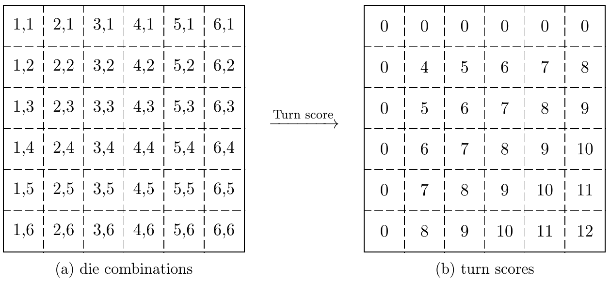

# IB Math AA HL Internal Assessment - May 2023

## Introduction
This repository contains the scripts and document for my Internal Assessment in
Mathematics: Analysis and Approaches at Higher Level as part of the International
Baccalaureate Diploma Programme. I submitted this IA in the M23 Session and ultimately
received a 7 for this course although I do not know exacty how much the IA influenced
this result as the exams account for a majority of the final grade. 

The IA is entitled _Investigating Optimal Strategies in the Dice Game 'Snake Eyes'_,
and as the title implies, concerns a simple dice game known as snake eyes. I
decided to investigate two main strategies and compare them using calculations as
well as simulations written in python to validate validate that the calculations
were not erroneous. Additionally I extended my investigation with biased dice to
observe how that affected the strategies.

## A Summary of the Results
This is a summary of the contents of [this document](internal-assessment.pdf).
### The rules of the game
The game can be played by two or more players, where the winner reaches a total score
of 100 points. The player can roll as many times as they wish in a single turn, with
the turn’s total score being the sum of dice of each roll within the turn. Yet, there
are some limitations, which are as follows:
1. The roll’s sum will only be counted if neither of the dice rolls a ‘1’
2. The roll’s sum will not be counted to the total if during the turn any dice rolls a ‘1’
3. If both dice roll a ‘1’ during a turn, the players total score gets reset to zero

Shown visually, here are the score outcomes of a single roll accompanied by a table showing
the proability distribution and its expected value $E(X_1)$.

<p align="center">
  
  
</p>

$$E(X_1) = \sum_{x=0}^{12} x \times P(X_1=x) = \frac{50}{9} \approx 5.56$$

### Strategy 1: Optimal Target Roll Quantity
A simple equation can be derived to find the expected value of a single turn given a target
number of rolls. This is a simple strategy in which the player keeps rolling until they
either reach their _target score_ or they lose.

$$E(X_r) = E(X_1) \cdot r\left( 1 - p(0) \right)^{r-1}$$

This can then be plotted on a graph along with the results of a simulation:
<p align="center">
  
</p>

Using this, we can estimate the amount of rolls needed to win a game:
$$\text{Estimated turns to win} = \frac{100}{E(X_1) \cdot r\left( 1 - \frac{11}{36} \right)^{r-1}}$$

Finally the average amount of rolls required to win a game can be plotted and the minimum can be observed
which will be the optimal _target roll_ quantity, which turns out to be 3 rolls.

<p align="center">
  
</p>

### Strategy 2: Optimal Target Score
Another equation can be derived to find the expected value of a single turn given a target score. With this
strategy the player keeps rolling until they reach a certain score at which point they stop rolling.


```math
P(X_r = x) =

\begin{dcases}
    P(X_{r-1}=0) + p(0)\cdot\sum_{i=4(t-1)}^{12(t-1)}P(X_{r-1}=i) & \text{if $x=0$} \\
    \sum_{i=\max(x-12, 4)}^{x-4} P(X_{r-1}=i) \cdot p(x-i) & \text{if $0 < x < s$} \\
    P(X_{r-1}=x) + \sum_{i=\max(x-12,4)}^{\min(x-4, s-1)} P(X_{r-1}=i) \cdot p(x-i) & \text{if $s \leq x < s+12$} \\
    0 & \text{otherwise}
\end{dcases}
```
```math
E(X_u) = \sum_{i=s}^{s+12} i \cdot P(X_u=i) \qquad u= \lceil \frac s 4 \rceil \text{ (upper bound of rolls)}$$
```

Again this can be plotted on a graph along with some results from the simulation:
<p align="center">
  
</p>

Next an game can be simulated to determine the optimal target score to minimise the number of turns required
to win the game. Again this can be plotted on a graph along with some results from the simulation:
<p align="center">
  
</p>

As can be seen from both plots, the optimal target score is 19.

### Effects of Biased Dice
I thought it would be interesting to see if biased dice affected, so I generated the following probability
distributions:

<p align="center">
  
</p>

This had the following effects on the optimal target rolls and target scores:
<p align="center">
  
</p>

It can be seen that dice that are weighted towards higher values have much higher expected values, but
also at higher numbers of target rolls. This is to be expected as the probability of rolling a 1 is lower,
meaning that there is a lower risk of losing the turn or rolling snake eyes. Specifically, the optimal score
for the lower-biased dice is $r = 2$, unbiased dice is $r = 3$, center-biased die is $r = 6$, and upper-biased
die is $r = 10$.

<p align="center">
  
</p>

As seen in the plot, the dice biased upwards have much higher expected values and occur at higher
target scores, which was also the case with target rolls. The lower-biased die peaks at s = 8, the
unbiased at $s = 19$, the center-biased at $s = 41$, and the upper-biased (not shown on plot) peaks at
$s = 88$.

## Running the Scripts
This repository contains a bash script called `gen.sh` which will run each type of die bias. This script
works by (crudely) commenting and uncommenting lines in the `sampling.py` script so in case of any errors
or interruptions, the comments may have to be reset. 

This script will also take a while to run, taking 1h 15m on my i5-8265U processor with 8GB RAM.

### Requirements
This script requires the following libraries to be installed:
- [`numpy`](https://numpy.org/) - mathematical computations
- [`numba`](https://numba.pydata.org/) - JIT complilation acceleration
- [`pandas`](https://pandas.pydata.org/) - data handling
- [`tqdm`](https://tqdm.github.io/) - terminal progress bars

This should work with with any version of python, as long as the libraries support it.
It's always good to check what version of python `numba` uses since that usually causes the most
problems.

## Citations
References can be found in the pdf, but I also added the `references.bib` file to the repository.
Here is a list of the sources I used in URL form:
- https://www.youtube.com/watch?v=m-wLev460aU
- https://colab.research.google.com/drive/1Mdk26YQYhUsfDSFNYzAL-qA9g_QmFooa?usp=sharing#scrollTo=4VQQk2fTe_sF
- https://medium.com/mlearning-ai/a-crash-course-in-markov-decision-processes-the-bellman-equation-and-dynamic-programming-e80182207e85
- https://arxiv.org/abs/0912.5518
- http://www.jstor.org/stable/3215500
- http://www.jstor.org/stable/3215561
